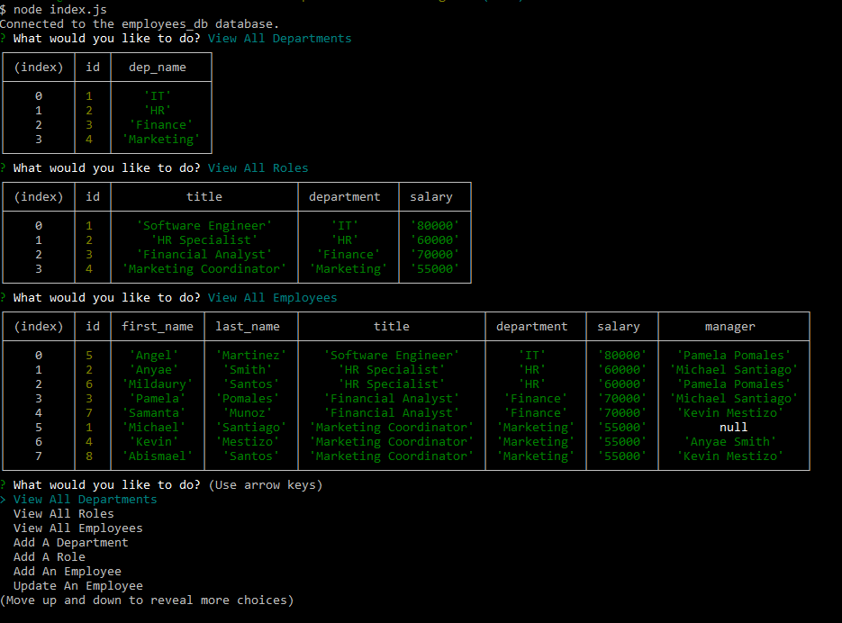

# Employee Tracker
    
## Description
    
This application allows users(owners of businesses) to easily oversee their departments, roles, and employee roster all in one place. They can also view what roles fall in what departments and which employees fall under which role, department and associated manager. To make updates they can also add departments, roles, and employees to the database, or update an individual employee to a new role. Using this application can expedite menial business tasks  regarding viewing and updating your business employee database for easy tracking.

## Screenshot

    
## Table of Contents
    
- [Installation](#installation)
- [Usage](#usage)
- [License](#license)
- [How to Contribute](#contributing)
- [Test](#test)
- [Questions](#questions)
    
## Installation
    
Once the application has been downloaded, run 'npm i' in your terminal to install dependencies. Once dependencies have been installed, run the 'node index.js' command to begin.
    
## Usage
    
Begin by running the schema file in your mysql terminal to create the database and tables. With everything setup you can then run the index file using 'node index.js'. Once running you are prompted to select an option using the arrow keys to navigate the menu and enter to make a selection. The database should be empty by default so you will need to start off by selecting 'add department' to add your first department for your business. After that is created, you can create a role associated with that department in 'Add a role' and finally you can add an employee and assocaite them with a role and a manager if you made an entry for one already. If needed, you can also update an employee's role using 'update employee'. From there you can now create an extensive database of departments, roles, and employees.
    
## License
    
MIT License
    
## Contributing
    
Following the structure of the prvious functions in the code. Devs can create new functions that would be able to update an employee's manager or a role's salary. Mostly just new features that allow for more flexibility in updating and changing the data in the database.
    
## Test
    
There are currently no ways to test it other than using it outright.
    
## Questions
    
My Github account is [GitHub.com/midasantiago](github.com/midasantiago)
    
If you wish to contact me you can do so at midasantiago98@gmail.com